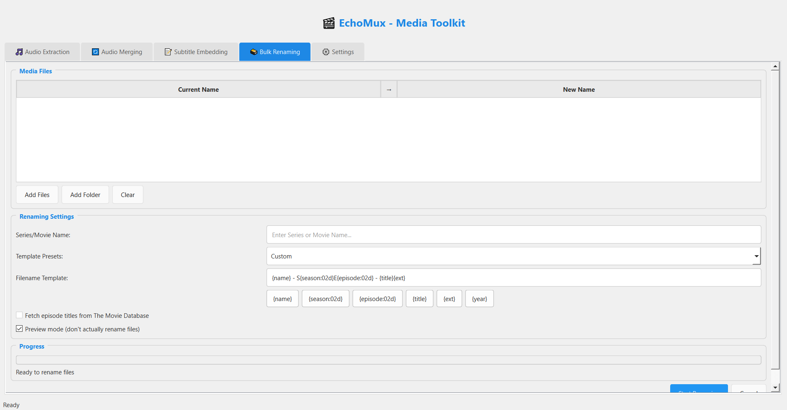
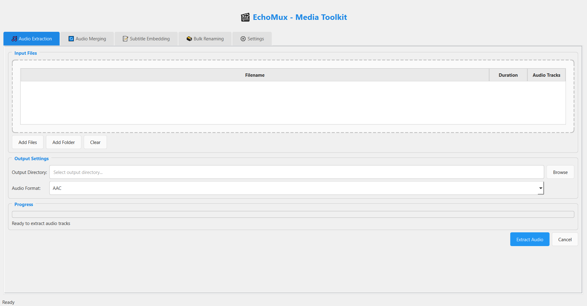

# 🎬 EchoMux - Multi-Track Video Remuxer & Media Manager

<div align="center">
  
  
  [](https://www.python.org/downloads/)
  [](https://pypi.org/project/PyQt6/)
  [](LICENSE)
  [](https://github.com/Mohammed-ALhassanSE/EchoMux/releases)
</div>

## 📋 Overview

EchoMux is a powerful, user-friendly desktop application built with PyQt6 that provides comprehensive media file management capabilities. Whether you're dealing with multi-language audio tracks, subtitle embedding, or bulk file organization, EchoMux streamlines your media workflow with an intuitive interface.

## ✨ Features

### 🎵 Audio Extraction
- Extract audio tracks from video files in multiple formats
- Support for AAC, MP3, FLAC, and OGG output formats
- Batch processing with progress tracking
- Preserve original audio quality

### 🔄 Audio Merging
- Merge multiple audio tracks into video files
- Intelligent filename matching for automated workflow
- Language metadata tagging support
- Preserve original video and audio streams

### 📝 Subtitle Embedding
- Embed subtitle files into video containers
- Auto-detect language from filename patterns
- Support for SRT, ASS, VTT, and SUB formats
- Soft subtitles (toggleable) and hard subtitles (burned-in) options
- File matching preview system

### 🗃️ Bulk Renaming
- Intelligent season/episode detection from filenames
- Customizable filename templates
- Preview mode to test changes before applying
- Support for multiple naming patterns (S01E01, 1x01, etc.)
- Optional integration with online databases for episode titles

## 🖼️ Screenshots

<div align="center">
  
  <p><em>Main interface with tabbed workflow</em></p>
</div>

<div align="center">
  
  <p><em>Audio extraction with drag-and-drop support</em></p>
</div>

## 🚀 Getting Started

### Prerequisites

- **Python 3.8 or higher**
- **FFmpeg** (must be accessible from command line)
  - Windows: Download from [ffmpeg.org](https://ffmpeg.org/download.html)
  - macOS: `brew install ffmpeg`
  - Linux: `sudo apt install ffmpeg` (Ubuntu/Debian) or equivalent

### Installation

#### Option 1: Download Executable (Recommended for most users)
1. Go to [Releases](https://github.com/Mohammed-ALhassanSE/EchoMux/releases)
2. Download the latest `EchoMux.exe`
3. Run the executable directly (FFmpeg still required separately)

#### Option 2: Install from Source
```bash
# Clone the repository
git clone https://github.com/Mohammed-ALhassanSE/EchoMux.git
cd EchoMux

# Install dependencies
pip install -r requirements.txt

# Run the application
python EchoMux.py
```

## 🎯 Usage Guide

### Basic Workflow
1. **Launch EchoMux** and select the appropriate tab for your task
2. **Add media files** using drag-and-drop or the "Add Files" button
3. **Configure settings** such as output directory and format options
4. **Preview changes** when available (subtitle embedding, bulk renaming)
5. **Start processing** and monitor progress in real-time

### Audio Extraction
- Drag video files into the input area
- Choose output directory and audio format
- Click "Extract Audio" to begin processing

### Audio Merging
- Add video files and corresponding audio files
- Configure language tags for proper metadata
- The system will automatically match files based on similar names
- Review the matching and start the merge process

### Subtitle Embedding
- Add video files and subtitle files
- Use the preview feature to verify file matching
- Choose between soft (toggleable) or hard (burned-in) subtitles
- Language detection works automatically based on filename patterns

### Bulk Renaming
- Add media files with episode information in filenames
- Enter the show name and customize the filename template
- Use preview mode to test the renaming pattern
- Apply changes when satisfied with the preview

## ⚙️ Configuration

### Filename Templates
EchoMux supports flexible filename templates for bulk renaming:

- `{show}` - Show/series name
- `{season:02d}` - Season number (zero-padded)
- `{episode:02d}` - Episode number (zero-padded)
- `{title}` - Episode title (if available)
- `{ext}` - File extension

**Example template:** `{show} - S{season:02d}E{episode:02d} - {title}{ext}`
**Result:** `Breaking Bad - S01E01 - Pilot.mkv`

### Supported File Formats

#### Video Formats
- MP4, MKV, AVI, MOV, M4V

#### Audio Formats
- AAC, MP3, FLAC, OGG, WAV, M4A

#### Subtitle Formats
- SRT, ASS, VTT, SUB

## 🏗️ Building from Source

### Create Executable with Auto-py-to-exe

```bash
# Install auto-py-to-exe
pip install auto-py-to-exe

# Launch GUI
auto-py-to-exe
```

**Recommended settings:**
- Script Location: `EchoMux.py`
- One File: Yes
- Console Window: Window Based (hide console)
- Icon: `icon/icon.ico`
- Additional Files: Include `icon` folder

### Manual PyInstaller Command
```bash
pyinstaller --noconfirm --onefile --windowed --icon="icon/icon.ico" --add-data="icon;icon" --name="EchoMux" EchoMux.py
```

## 🤝 Contributing

Contributions are welcome! Please feel free to submit a Pull Request. For major changes, please open an issue first to discuss what you would like to change.

### Development Setup
```bash
git clone https://github.com/Mohammed-ALhassanSE/EchoMux.git
cd EchoMux
pip install -r requirements.txt
pip install -r requirements-dev.txt  # If development dependencies exist
```

## 🐛 Known Issues & Limitations

- **FFmpeg Dependency**: FFmpeg must be installed separately and accessible from command line
- **File Size**: Executable is large (~100-200MB) due to Python and PyQt6 bundling
- **Performance**: Processing large files may take significant time depending on system specs
- **Language Detection**: Automatic language detection relies on filename patterns

## 📝 License

This project is licensed under the MIT License - see the [LICENSE](LICENSE) file for details.

## 👨‍💻 Author

**Mohammed AL Hassan**
- GitHub: [@Mohammed-ALhassanSE](https://github.com/Mohammed-ALhassanSE)

## 🙏 Acknowledgments

- Built with [PyQt6](https://www.riverbankcomputing.com/software/pyqt/) for the GUI framework
- Powered by [FFmpeg](https://ffmpeg.org/) for media processing
- Inspired by the need for efficient media workflow management

## 📊 Project Stats


---

<div align="center">
  <p>⭐ If you found this project helpful, please consider giving it a star!</p>
</div>